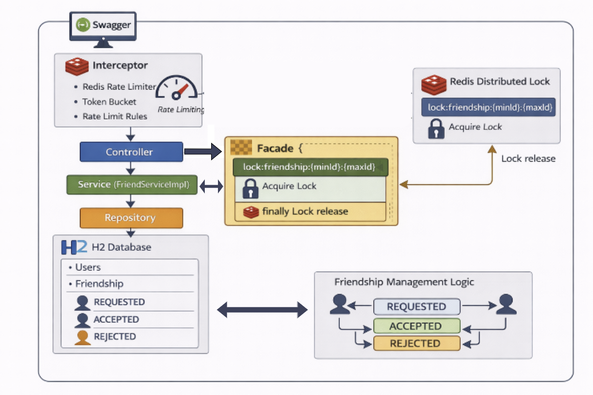

# apr-backend-assignment
에이피알 백엔드 과제 전형 - 친구 관리 시스템 구축

사용자 인증 기능이 없기에 목록 조회 API는 기본적으로 사용자 아이디 (1L)을 기준으로 조회합니다.

## 🛠 기술 스택
- **언어**: Java 21
- **프레임워크**: Spring Boot 3.5.9
- **데이터베이스**: H2 Database 2.4.240
- **동시성/캐시**: Redis 7.4.2 (Redisson)
- **빌드 도구**: Gradle 8.6
- **ORM**: Spring Data JPA / Hibernate


## 🚀 아키텍처 구성도

## 🚀 핵심 설계 전략 및 문제 해결

### 1. 동시성 제어: Redis 분산 락 & Facade 패턴
* **문제 배경**: 친구 신청 시 A→B, B→A가 동시에 발생하는 경우, DB 유니크 제약만으로는 트랜잭션 격리 수준에 따라 중복 데이터가 생성되는 'Race Condition'이 발생할 수 있습니다.
* **해결 전략**: Redisson의 분산 락을 도입하여 동일 사용자 쌍의 요청을 직렬화했습니다.
* **Facade 패턴 적용**: `@Transactional`은 메서드 종료 후 커밋을 수행하므로, 락 해제가 커밋보다 먼저 일어나 정합성이 깨지는 것을 방지하기 위해 락의 범위를 트랜잭션 외부로 감싸는 Facade 레이어를 별도로 구축했습니다.


### 2. 요청 제한(Rate Limit): Redis 기반 Token Bucket
* **해결 전략**: Redis의 `RRateLimiter`를 사용하여 Token Bucket 기반 요청 제한을 구현했습니다.
* **설계**: 단일 서버에 종속적인 인메모리 방식과 달리, 분산 서버 환경에서도 모든 인스턴스가 동일한 요청 카운트를 공유하여 일관된 정책 적용이 가능합니다.


### 3. 데이터 모델링 및 조회 최적화
* **단일 레코드 양방향 구조**: 친구 관계를 (A, B) 단일 레코드로 저장하여 저장 공간을 효율화하고, 조회 시 `requester`와 `receiver`를 동시에 탐색하여 논리적인 양방향 관계를 구현했습니다.
* **상태 관리**: 친구 관계의 상태를 `REQUESTED`, `ACCEPTED`, `REJECTED`로 구분하여 다양한 비즈니스 로직을 명확히 처리할 수 있도록 설계했습니다.

## 📋 API 명세 요약
| 기능 | 메서드 | 엔드포인트 | 특징 |
|:--- |:---:|:--- |:--- |
| 친구 목록 조회 | `GET` | `/api/friends` | ACCEPTED 상태인 관계만 페이징 조회 |
| 받은 요청 목록 | `GET` | `/api/friends/requests` | 기간 필터(1d, 7d, 30d 등) 지원 |
| 친구 신청 | `POST` | `/api/friends/request` | 분산 락 및 Rate Limit 적용 |
| 요청 수락 | `POST` | `/api/friends/accept/{requestId}` | 수락 전 최대 친구 수 검증 |
| 요청 거절 | `POST` | `/api/friends/reject/{requestId}` | 거절 후 재신청 가능 구조 |


## 📋 API 명세 상세 정리
- 친구 목록 조회:
  - 친구 관계 상태가 ACCEPTED인 항목만 페이징 처리하여 반환.
  - response의 'user_id' 필드에는 친구의 사용자 ID 응답, from_user_id 및 to_user_id는 각각 발신자, 수신자로 구분하였습니다.
  - approved_at 응답 필드는 updated_time과 동일한 값입니다.
  
- 받은 요청 목록:
  - `window` 쿼리 파라미터로 기간 필터 적용(1d, 7d, 30d, 90d, over).
  - 페이징 파라미터는 page(0-based), maxSize(1~100), sort(field,dir) 형식으로 받습니다.
  - response의 `request_id`는 Friendship의 UUID, `request_user_id`는 요청자 ID, `requestedAt`은 created_time 값입니다.
  - `window=over`일 때는 기간 제한 없이 전체 요청을 조회합니다.
  
- 친구 신청:
  - 요청 헤더 `X-user-Id`와 body의 `targetUserId`로 요청자/대상자를 구분합니다.
  - 동일 요청이 존재하면 에러를 반환하며, REJECTED 이력이 있으면 REQUESTED 상태로 갱신하고 요청 시간을 업데이트합니다.
  - 분산 락으로 동시 요청 중복 생성 방지, 요청당 Rate Limit(기본: 1초 10회)이 적용됩니다.
  - 자기 자신에게 요청한 경우 에러를 반환합니다.
  
- 요청 수락:
  - 요청 헤더 `X-user-Id`는 수신자여야 하며, 본인 수신 요청만 처리 가능합니다.
  - REQUESTED 상태에서만 수락 가능하며, 수락 시 상태가 ACCEPTED로 변경됩니다.
  - 수락 전 요청자/수신자 모두 친구 수 제한(max-friend) 검증을 수행합니다.
  
- 요청 거절:
  - 요청 헤더 `X-user-Id`는 수신자여야 하며, 본인 수신 요청만 처리 가능합니다.
  - REQUESTED 상태에서만 거절 가능하며, 거절 시 상태가 REJECTED로 변경됩니다.
  - 거절된 요청은 이후 동일 사용자 간 재신청이 가능합니다.

## 🛠 실행 방법
1. **애플리케이션 실행**:
   ```bash
   ./gradlew bootRun
Swagger UI: http://localhost:8080/swagger-ui.html

## 🔍 Troubleshooting
이슈: Service 레이어 내에서 @Transactional과 락을 함께 사용 시, 락 해제 후 커밋 전 찰나의 순간에 중복 요청이 통과되는 현상 발견.

해결: 락 획득/해제 로직을 트랜잭션이 없는 Facade 레이어로 분리하여, [락 획득 -> 트랜잭션 시작 -> 커밋 -> 락 해제] 순서를 보장함으로써 데이터 정합성 완벽 확보.
