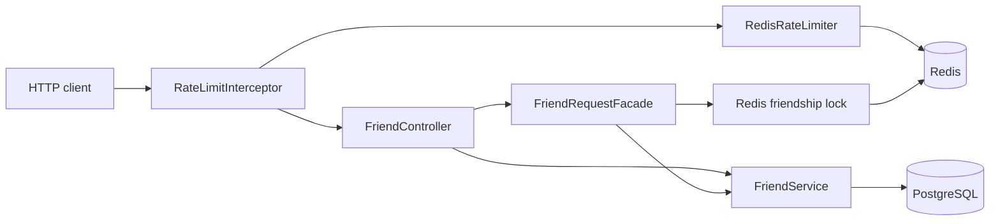

# 목표 시스템
친구 관리 시스템 구축

> **리팩토링 진행 상태 (2026-10-28):** 1~6번은 `refactor/backend-quality` 브랜치에 게시했습니다. 6번의 코드·테스트·설정 정리는 커밋 `ef79016`에 반영됐습니다. 현재 상태와 사용자 결정은 [상태 기록](agent-context/STATE.json)과 [결정 기록](agent-context/DECISIONS.md)을 참조하세요.

사용자 인증 기능이 없기에 목록 조회 API는 기본적으로 사용자 아이디 (1L)을 기준으로 조회합니다.

## 🛠 기술 스택
- **언어**: Java 21
- **프레임워크**: Spring Boot 3.5.9
- **데이터베이스**: PostgreSQL 16 (Docker Compose)
- **동시성/캐시**: Redis 7.4.2 (Redisson)
- **빌드 도구**: Gradle 8.14.3 (wrapper)
- **ORM**: Spring Data JPA / Hibernate


## 🚀 아키텍처 구성도

아래 흐름은 현재 코드의 책임 경계입니다. 이전 `architecture.png`는 H2 기반 구성과 이전 계층명을 포함하므로 참고 이미지로만 보존합니다.


```mermaid
flowchart LR
    Client[HTTP client] --> Limit[RateLimitInterceptor]
    Limit --> Controller[FriendController]
    Controller --> Facade[FriendRequestFacade]
    Controller --> Service[FriendService]
    Facade --> Lock[Redis friendship lock]
    Limit --> Rate[RedisRateLimiter]
    Rate --> Redis[(Redis)]
    Lock --> Redis
    Facade --> Service
    Service --> Postgres[(PostgreSQL)]
```

친구 신청은 `friendship.presentation.FriendController`에서 시작해
`friendship.application.FriendRequestFacade`와 `FriendServiceImpl`로 이어집니다.
잠금은 `friendship.infrastructure.FriendshipLockProvider`, 요청 제한은 `ratelimit` 패키지가 담당합니다.
## 🚀 핵심 설계 전략 및 문제 해결

### 1. 동시성 제어: DB 행 잠금·유일 제약과 Redis 분산 락
* **신청·수락·거절**: 서비스 트랜잭션에서 참여 사용자 행을 ID 오름차순으로 잠근 뒤 관계 상태를 조회합니다. 수락 시 양쪽 친구 수를 잠금 안에서 확인합니다.
* **양방향 중복 방지**: PostgreSQL의 `ux_friendship_active_pair` 부분 유일 인덱스가 사용자 쌍의 방향과 무관하게 `REQUESTED`·`ACCEPTED` 관계를 하나로 제한합니다. 기존 방향별 유일 제약도 유지합니다.
* **Redis 보조 잠금**: 신청 경로의 Facade가 분산 락을 서비스 트랜잭션 바깥에서 관리합니다. Redis 장애나 락 TTL 만료 시에도 DB 잠금과 유일 제약으로 정합성을 지킵니다.


### 2. 요청 제한(Rate Limit): Redis 기반 Token Bucket
* **해결 전략**: Redis의 `RRateLimiter`를 사용하여 Token Bucket 기반 요청 제한을 구현했습니다.
* **설계**: Redis 사용 시 모든 인스턴스가 요청 카운트를 공유합니다. Redis 장애 시에는 인스턴스별로 최대 10,000명분의 제한 창을 보관하는 로컬 제한으로 전환합니다. 이때 인스턴스 간 카운트는 공유되지 않습니다.


### 3. 데이터 모델링 및 조회 최적화
* **활성 관계와 거절 이력**: 활성 관계는 사용자 쌍당 한 행입니다. 거절 후 반대 방향으로 신청하면 기존 `REJECTED` 행을 보존하고 새 행을 만들 수 있습니다. 조회 시 `requester`와 `receiver`를 모두 탐색합니다.
* **상태 관리**: 친구 관계의 상태를 `REQUESTED`, `ACCEPTED`, `REJECTED`로 구분하여 다양한 비즈니스 로직을 명확히 처리할 수 있도록 설계했습니다.

## 📋 API 명세 요약
| 기능 | 메서드 | 엔드포인트 | 특징 |
|:--- |:---:|:--- |:--- |
| 친구 목록 조회 | `GET` | `/api/friends` | ACCEPTED 상태인 관계만 페이징 조회 |
| 받은 요청 목록 | `GET` | `/api/friends/requests` | 기간 필터(1d, 7d, 30d 등) 지원 |
| 친구 신청 | `POST` | `/api/friends/request` | DB 잠금·활성 쌍 유일 제약, Redis 락 및 요청 제한 적용 |
| 요청 수락 | `POST` | `/api/friends/accept/{requestId}` | 참여자 잠금 후 양쪽 최대 친구 수 검증 |
| 요청 거절 | `POST` | `/api/friends/reject/{requestId}` | 참여자 잠금 후 REQUESTED 관계를 REJECTED로 변경 |


## 📋 API 명세 상세 정리
- 친구 목록 조회:
  - 친구 관계 상태가 ACCEPTED인 항목만 페이징 처리하여 반환.
  - 응답의 `userId`는 친구의 사용자 ID이며, `fromUserId`와 `toUserId`는 각각 발신자와 수신자의 ID입니다.
  - 응답의 `approvedAt`은 수락 시 `approved_at`에 저장한 실제 수락 시각입니다. `approvedAt` 정렬 키도 이 수락 시각을 사용합니다.
  - 일반 수정 시각은 감사 필드 `updatedTime`으로 관리하며, 수락 시각과 별도로 보관합니다.
  
- 받은 요청 목록:
  - `window` 쿼리 파라미터로 기간 필터 적용(1d, 7d, 30d, 90d, over).
  - 페이징 파라미터는 page(0-based), maxSize(1~100), sort(field,dir) 형식으로 받습니다.
  - response의 `requestId`는 Friendship의 UUID, `requestUserId`는 요청자 ID, `requestedAt`은 신청 시각입니다. 같은 방향으로 재신청하면 새 신청 시각을 사용합니다. `requested_at`이 없는 기존 행은 `created_time`을 사용합니다.
  - `window=over`일 때는 기간 제한 없이 전체 요청을 조회합니다.
  
- 친구 신청:
  - 요청 헤더 `X-user-Id`와 body의 `targetUserId`로 요청자/대상자를 구분합니다.
  - 같은 방향의 거절된 요청을 다시 신청하면 그 행을 `REQUESTED`로 바꾸고 기존 요청 UUID를 재사용합니다. 반대 방향 재신청은 새 행과 UUID를 만들며 과거 거절 행을 보존합니다.
  - 이미 `REQUESTED` 또는 `ACCEPTED`인 관계는 중복 신청할 수 없습니다. DB의 활성 쌍 유일 제약 충돌은 HTTP 409와 `FRIEND_REQUEST_CONFLICT` 코드로 응답합니다.
  - Redis 분산 락과 요청 제한(기본: 1초 10회)을 사용합니다. Redis 장애 시 신청은 DB 보호 아래 진행하고 요청 제한은 인스턴스별 로컬 제한을 사용합니다.
  - 자기 자신에게 요청한 경우 에러를 반환합니다.
  
- 요청 수락:
  - 요청 헤더 `X-user-Id`는 수신자여야 하며, 본인 수신 요청만 처리 가능합니다.
  - REQUESTED 상태에서만 수락 가능하며, 수락 시 상태가 ACCEPTED로 변경됩니다.
  - 수락 전 요청자/수신자 모두 친구 수 제한(max-friend) 검증을 수행합니다.
  
- 요청 거절:
  - 요청 헤더 `X-user-Id`는 수신자여야 하며, 본인 수신 요청만 처리 가능합니다.
  - REQUESTED 상태에서만 거절 가능하며, 거절 시 상태가 REJECTED로 변경됩니다.

### 오류 응답 규약

모든 오류 응답은 기존 공통 형식의 `status`, `code`, `message`를 사용합니다.

- 필수 `X-user-Id` 헤더의 누락·형식 오류·0 이하 값, 필수 쿼리 파라미터 누락·형식 오류,
  잘못된 정렬·페이지 값, 잘못된 UUID, JSON 본문 오류와 필수·양수 값 검증 실패는 HTTP 400 및
  `BAD_REQUEST`로 응답합니다. 메시지는 `잘못된 요청입니다.`입니다.
- 요청 수신자가 아닌 사용자의 수락·거절은 HTTP 403 `ONLY_RECEIVER_CAN_PROCESS`로 응답합니다.
  이미 처리된 요청의 수락·거절은 HTTP 400 `REQUEST_STATUS_ERROR`로 응답합니다.
- 활성 친구 요청의 DB 유일 제약 충돌은 HTTP 409 `FRIEND_REQUEST_CONFLICT`로 응답합니다.
  Redis 락을 얻지 못해 같은 요청이 처리 중이면 HTTP 423 `CONCURRENT_FRIEND_REQUEST`로 응답합니다.
- DB 자체 장애나 잠금 대기 실패는 HTTP 503 `DATABASE_UNAVAILABLE`로 응답합니다. 서버 오류의
  공개 메시지는 `서버에 문제가 생겼습니다. 잠시 후 다시 시도해주세요.`로 통일합니다.

이 오류 규약은 [FriendController](src/main/java/com/apr/aprbackendassignment/friendship/presentation/FriendController.java),
[CommExceptionControllerAdvice](src/main/java/com/apr/aprbackendassignment/common/advice/CommExceptionControllerAdvice.java),
그리고 사용자 결정 기록의 `S4-001`에 근거합니다.

## 🛠 실행 방법

1. **PostgreSQL 실행** (프로젝트 루트):

   ```bash
   docker compose up -d --build --wait
   docker compose ps
   ```

   공식 PostgreSQL 이미지를 사용하므로 별도 Dockerfile 빌드는 필요하지 않습니다.
   기본 접속 정보는 `localhost:5432`, DB `apr`, 사용자 `apr`, 비밀번호 `apr_local_password`입니다.
   비밀번호는 로컬 개발용 기본값입니다. `POSTGRES_DB`, `POSTGRES_USER`, `POSTGRES_PASSWORD`, `POSTGRES_PORT` 환경변수로 변경할 수 있습니다.
   변경한 환경변수는 Compose와 애플리케이션 실행 환경 모두에 동일하게 전달해야 합니다.
   Compose의 `.env` 파일은 애플리케이션에서 자동으로 읽지 않습니다.
   데이터는 프로젝트 전용 `postgres-data` 볼륨에 보관되며, `docker compose down`으로 컨테이너를 종료해도 유지됩니다.
   DB 이름과 계정 환경변수는 볼륨을 처음 초기화할 때 적용됩니다. 기존 볼륨의 계정은 환경변수만 바꿔도 변경되지 않습니다.

2. **Redis 준비**: 애플리케이션은 `localhost:6379`의 Redis를 사용합니다. 이번 Compose에는 PostgreSQL만 포함되어 있습니다.

3. **애플리케이션 실행**:

   ```bash
   ./gradlew bootRun
   ```

   Windows PowerShell에서는 `.\gradlew.bat bootRun`을 사용합니다.
   `ddl-auto: update`로 엔티티에서 PostgreSQL 테이블을 생성·갱신한 다음, `src/main/resources/schema.sql`이
   `requested_at`, `approved_at` 열과 활성 사용자 쌍 유일 인덱스를 설치합니다.
   기존 데이터에 같은 사용자 쌍의 활성 관계가 둘 이상 있으면 인덱스 생성이 실패해 애플리케이션 시작이 중단됩니다. 거절 이력을 자동 삭제하거나 이전하지 않습니다.
   저장소 루트의 `sql/schema.sql`은 기존 H2용 참고 스키마이며 이 Compose에서는 실행하지 않습니다. 기존 H2 데이터는 자동으로 이전되지 않습니다.

Swagger UI: http://localhost:8080/swagger-ui.html

## 테스트 실행

Docker가 실행 중인 상태에서 프로젝트 루트에서 실행합니다.

```powershell
.\gradlew.bat test
```

테스트는 Testcontainers로 PostgreSQL 16과 Redis 7.4.2를 임의의 호스트 포트에서 실행합니다.
개발용 Compose나 기존 사용자·친구 데이터는 필요하지 않습니다. 최초 실행에는 테스트 의존성과 Docker 이미지 다운로드가 필요합니다.
모든 통합 테스트는 `IntegrationTestSupport`를 상속하며, `test` 프로필의 접속 정보를 해당 컨테이너로 지정합니다.
컨테이너를 시작하지 못하면 테스트가 실패하며 개발 DB로 대체 접속하지 않습니다.

각 테스트 전후에 전용 DB의 테이블과 Redis DB를 초기화합니다. 전체 테스트를 감싸는 트랜잭션은 사용하지 않으므로
Facade의 실제 서비스 커밋과 작업 스레드의 결과를 별도 트랜잭션에서 확인합니다.
공유 테스트 환경의 정리를 위해 테스트는 순차 실행합니다. 컨테이너는 재사용하지 않으며 테스트 JVM 종료 시 Testcontainers가 정리합니다.
조회 API가 사용자 ID `1`을 사용하는 현재 규약은 테스트 DB의 identity 초기화 후 첫 사용자 fixture로 재현합니다.
변경 API 테스트는 fixture 생성 시 반환된 ID와 UUID를 사용합니다.

클래스나 메서드 하나만 실행할 수도 있습니다.

```powershell
.\gradlew.bat test --tests '*FriendServiceImplTest'
.\gradlew.bat test --tests '*FriendServiceImplTest.concurrentOppositeRequestsCreateExactlyOneRelationship'
```

요청 제한 HTTP 테스트는 MockMvc와 실제 Redis를 사용합니다. 시간 경과로 토큰이 다시 생기는 영향을 줄이기 위해
테스트 프로필의 제한 시간 창만 60초로 설정하고, 허용 횟수·초과 응답·사용자 간 격리를 검증합니다.
수락·거절 경쟁, 공유 사용자의 친구 수 상한 경쟁, Redis 장애·락 TTL 만료, DB 제약과 409·503 응답은 별도 통합 테스트에서 확인합니다.
결과 보고서는 `build/reports/tests/test/index.html`에 생성됩니다.

개발용 샘플 생성은 검증 테스트와 별도 source set으로 분리했습니다. 아래 명령은 **현재 설정된 개발 DB에 데이터를 추가**하며,
DB와 Redis를 준비한 뒤 필요한 경우에만 명시적으로 실행합니다.

```powershell
.\gradlew.bat seedSampleData --args='100'
```

기본값은 100건이며 1~10,000건을 지정할 수 있습니다. 새 수신자 1명과 요청자·요청을 만들고,
요청 시각을 0·6·29·89·120일 전으로 나눕니다. 생성된 수신자 ID는 로그에서 확인할 수 있습니다.
이 명령은 실행할 때마다 데이터를 추가하며 고정 사용자 ID나 기존 데이터에 의존하지 않습니다.

## 리팩토링 에이전트 실행

리팩토링 브랜치는 `refactor/backend-quality`입니다. [AGENTS.md](AGENTS.md)를 공통 진입점으로 사용하고,
[실행 체인](agent-context/WORKFLOW.md), [1~6단계 계획](agent-context/PLAN.md),
[진행 상태](agent-context/STATE.json)를 통해 다음 세션에 작업을 이어갑니다.
1번 테스트 기반과 에이전트 실행 환경 구성은 이전 체크포인트입니다. 단계별 완료 여부와 검증 근거는 [진행 상태](agent-context/STATE.json)에서 확인합니다.

프로젝트의 `.codex/agents/`에는 오케스트레이터, DDD 설계, 백엔드 구현, 테스트, 코드 리뷰, 보안 리뷰, 문서 관리 역할이 정의되어 있습니다.
모델과 권한은 부모 세션에서 상속합니다. 정의 형식은 [공식 Codex 서브에이전트 문서](https://learn.chatgpt.com/docs/agent-configuration/subagents)를 따릅니다.
현재 세션에 새 역할이 보이지 않으면 기본 에이전트에 해당 `agent-context/roles/` 문서와 소유 파일을 전달합니다.

다음 작업의 시작 프롬프트:

```text
AGENTS.md와 agent-context/WORKFLOW.md를 읽고 refactor_orchestrator를 중심으로
BACKEND_QUALITY_REVIEW.md 20절의 1~6단계를 현재 STATE.json에서 재개해.
완료한 1번은 회귀 검증하고, 단계별 설계→구현·테스트→검증→독립 리뷰를 진행해.
리뷰 지적은 담당 전문 에이전트에 재배정해 수정하고 다시 리뷰해.
모든 단계가 완료되고 최종 리뷰의 수정 필요가 0건이면 필수 린트·테스트를 거쳐
현재 refactor/backend-quality 브랜치에 자동으로 커밋하고 origin에 일반 push해.
```

새 체크아웃에서는 Git 훅을 한 번 설치합니다.

```powershell
powershell -NoProfile -File scripts/install-git-hooks.ps1
.\gradlew.bat lint
```

`pre-commit` 훅이 린트를 실제 실행하고 실패한 커밋을 차단합니다. 자동 게시 절차는
`scripts/publish-reviewed.ps1`에서 독립 리뷰 승인과 검토한 staged tree를 확인한 뒤
검증·커밋·푸시를 순서대로 수행합니다. 상세 실행법과 재검토 조건은 실행 체인을 따릅니다.

## 🔍 Troubleshooting
이슈: Service 레이어 내에서 @Transactional과 락을 함께 사용 시, 락 해제 후 커밋 전 찰나의 순간에 중복 요청이 통과되는 현상 발견.

현재 구현: 신청 경로는 Facade의 Redis 락 안에서 서비스 트랜잭션을 커밋합니다. 서비스는 참여 사용자 행을 정해진 순서로 잠그며 PostgreSQL 부분 유일 인덱스가 양방향 활성 관계의 중복을 막습니다. Redis가 응답하지 않거나 락 TTL이 먼저 만료되어도 DB 규칙을 적용합니다.
